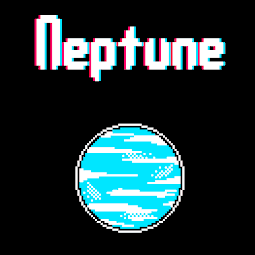
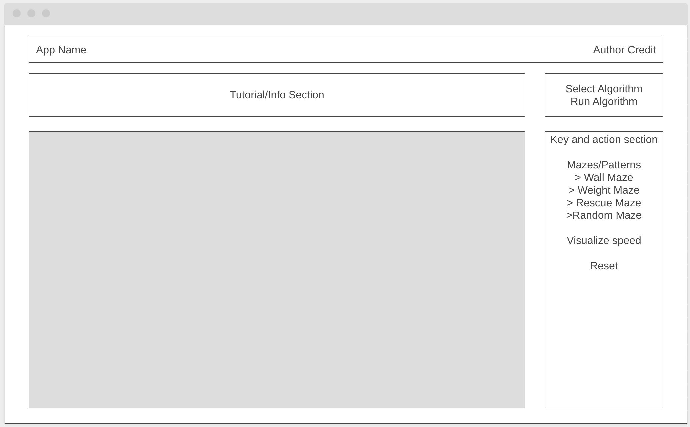
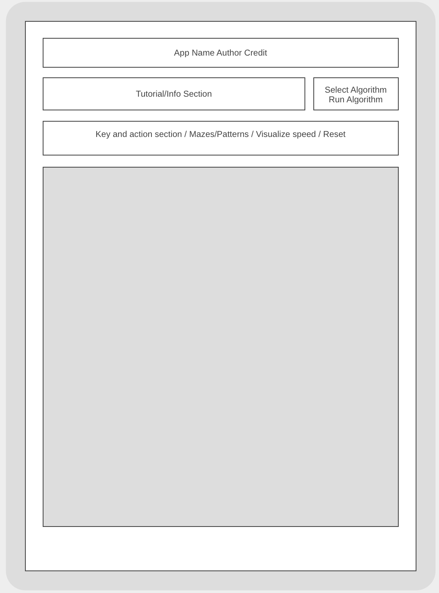
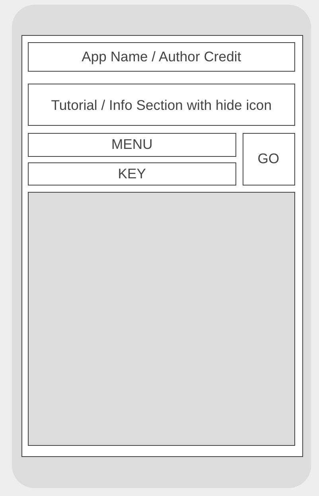

https://dd-pathfinder.netlify.app/

# PROJECT 2 README <!-- omit in toc -->

- [Project Planning](#project-planning)
  - [Overview](#overview)
  - [Wireframes](#wireframes)
  - [MVP](#mvp)
    - [Goals](#goals)
    - [Libraries](#libraries)
    - [Data](#data)
    - [Component Hierarchy](#component-hierarchy)
    - [Component Breakdown](#component-breakdown)
    - [Component Estimates](#component-estimates)
    - [Helper Functions](#helper-functions)
  - [Post-MVP](#post-mvp)
- [Project Delivery](#project-delivery)
  - [Code Showcase](#code-showcase)
  - [Code Issues & Resolutions](#code-issues--resolutions)

## Project Planning


### Overview

**PathFinder** 

**Project Description:** Visualizing tool utilizing pathfinding algorithms to solve variety of mazes.

<br>

### Wireframes
<br>

- Desktop View

<br>

- Tablet View

<br>

- Mobile View

<br>

### MVP


_The **PathFinder** MVP requires an interactive React app website with atleast 6 separate rendered componenets, and 5 reusable Storybook components._

_App must utilize React Router, Axios, CSS styling, responsive layout (Flexbox or Grid), high quality code presentation, and live deployment._

_App must be submitted with clean file structure, frequent deployment history and thourough documentation_
<br>

#### Goals

- _Incorporating assortment of algorithms._
- _Enhancing user interactivity._
- _Achieving clean and memorable design._


<br>

#### Libraries


|     Library      | Description                                |
| :--------------: | :----------------------------------------- |
|   React Router   | _Allows me to link and route between pages._ |
| Framer Motion| _Adds animation to my page._ |
|   Axios   | _Imports data for maze rendering._ |

<br>

#### Data


|    API     | Quality Docs? | Website       | Sample Query                            |
| :--------: | :-----------: | :------------ | :-------------------------------------- |
| Mazebot API |      yes      | _https://noopschallenge.com/challenges/mazebot_ | _https://api.noopschallenge.com/mazebot/random?minSize=10&maxSize=10_ |

```
{
    "name": "Maze #27 (10x10)",
    "mazePath": "/mazebot/mazes/7lzE49LbL9mTrSfDBfK_Tf3jQ9SQX7idJSEXgctTbjM",
    "startingPosition": [
        4,
        4
    ],
    "endingPosition": [
        2,
        9
    ],
    "message": "When you have figured out the solution, post it back to this url in JSON format. See the exampleSolution for more information.",
    "exampleSolution": {
        "directions": "ENWNNENWNNS"
    },
    "map": [
        [
            " ",
            " ",
            " ",
            " ",
            "X",
            " ",
            " ",
            "X",
            "X",
            "X"
        ],
        [
            " ",
            " ",
            "X",
            " ",
            " ",
            " ",
            " ",
            "X",
            "X",
            "X"
        ],
```

<br>

#### Component Hierarchy

> Use this section to define your React components and the data architecture of your app.

```
src
|__ assets/
      |__ fonts
      |__ graphics
      |__ images
      |__ mockups
|__ components/
      |__ Header.jsx
      |__ Maze.jsx
      |__ MazeRow.jsx
      |__ MazeNode.jsx
      |__ AlgoSelect.jsx
      |__ Selector.jsx
      |__ Key.jsx
```

<br>

#### Component Breakdown

> Use this section to go into further depth regarding your components, including breaking down the components as stateless or stateful, and considering the passing of data between those components.

|  Component   |    Type    | State | Props | Description                                                      |
| :----------: | :--------: | :---: | :---: | :--------------------------------------------------------------- |
|    Header    | functional |   n   |   n   | _The header will contain App name and author info._               |
|  Maze  | functional |   y   |   n   | _Maze renders the entirity of the maze together._       |
|   MazeRow    |   functional    |   n   |   y   | _MazeRow is  1 horizontal section of the maze._      |
| Node | functional |   n   |   y   | _Node is 1 section of MazeRow._                 |
|   Key   | functional |   n   |   n   | _Provides info about the MazeMap._ |
|   AlgoSelector   | functional |   y   |   y   | _Selects which algorithm to use for solving the maze._ |
|   Key   | functional |   n   |   n   | _Explaing the visuals on the map_ |

<br>

#### Component Estimates

> Use this section to estimate the time necessary to build out each of the components you've described above. 
>
> Time frames are key to the development cycle. You have limited time to code your app, and your estimates can then be used to evalute possibilities of your MVP and post-MVP based on time needed. It's best you assume an additional hour for each component, as well as a few hours added to the total time, to play it safe.

| Task                | Priority | Estimated Time | Time Invested | Actual Time |
| ------------------- | :------: | :------------: | :-----------: | :---------: |
| Create Maze   |    H     |     5 hrs      |     TBD     |    TBD    |
| Style Maze Components |    L     |     8 hrs      |     TBD     |     TBD     |
Implement Algorithms |    H     |     8 hrs      |     TBD     |     TBD     |
Add animations |    M     |     8 hrs      |     TBD     |     TBD     |
Add key section |    L     |     4 hrs      |     TBD     |     TBD     |
Add info section |    L     |     4 hrs      |     TBD     |     TBD     |
| TOTAL               |          |     37 hrs      |     TBD    |     TBD     |

<br>

#### Helper Functions

> Use this section to document all helper functions, i.e. generic functions that can be reused in other applications.

|  Function  | Description                                |
| :--------: | :----------------------------------------- |
| Capitalize | _Lorem ipsum dolor sit amet, consectetur._ |

<br>

### Post-MVP

> Use this section to document ideas you've had that would be fun (or necessary) for your Post-MVP. This will be helpful when you return to your project after graduation!

- _Adding more algorithms._
- _Create your own maze on click._

<br>

***

## Project Delivery

### Code Showcase

> Use this section to include a brief code snippet of functionality that you are proud of and a brief description.

```
code snippet here
```

### Code Issues & Resolutions

> Use this section to list of all major issues encountered and their resolution, if you'd like.
